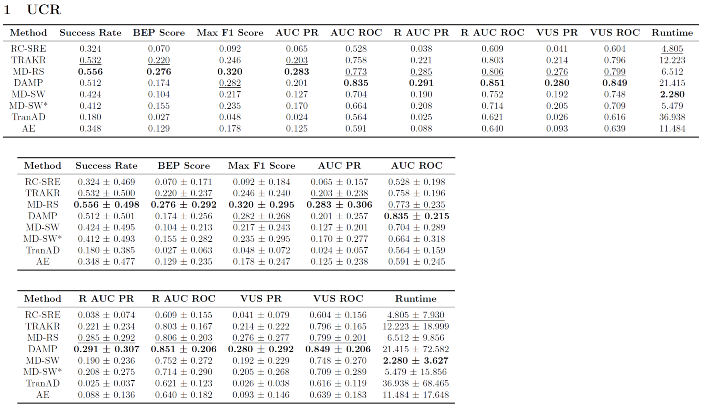

# MD-RS (Under Review)

## Architecture

## Overview

# Get Started

1. Install Python ..., PyTorch >= ....
2. Download data. You can obtain all benchmarks from [Google Cloud](). All the datasets are well pre-processed.
3. Train and evaluate. We provide the experiment scripts of all benchmarks under the folder  `./scripts`. You can reproduce the experiment results as follows:

# Main Results

## Overall Results

### UCR

### SMD

### SMAP

### MSL

### PSM

### SWaT

## Case Studies

## Noise Robustness Evaluation

