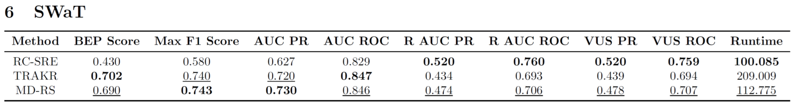
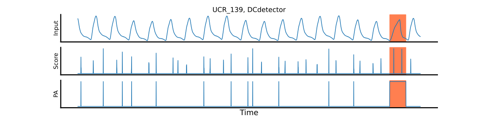

# Getting Started

## Prerequisites

- Install Python 3.8 or higher.

- Install dependencies:

```bash
pip install -r requirements.txt
```

## Data Preparation

1. Download time-series anomaly detection benchmark datasets following (https://github.com/elisejiuqizhang/TS-AD-Datasets).

2. Organize data:
Place datasets in `benchmarks/{dataset_name}/data`.

## Running the Code

Run the main script with your chosen options:

```bash
python main.py --benchmark UCR --method MDRS
```

- Supported benchmarks: `UCR, SMD, SMAP, MSL, PSM, SWaT`

- Methods: `SPE, TRAKR, MDRS, MDSW_fixed, MDSW_adjusted`

## Results

- Results are saved in `results` and `plots` directories within each benchmark folder.
- Runtime analysis is stored in `analysis` directory within each benchmark folder.


# MD-RS (Under Review)

## Architecture


## Demonstration of Time-Series Anomaly Detection using MD-RS (UCR_139)


## Result Overview| Performance vs. Runtime (UCR Dataset)
  


## Delay Comparison: Sliding Windows vs. Reservoir Computing

Methods that use sliding windows as feature vectors, such as DAMP, MD-SW, and many deep learning techniques, utilize a fixed window size, which presents the following disadvantages:


- **Delayed Onset Detection**: When an anomaly begins, the majority of the window's elements still reflect normal inputs. As a result, this delays the detection of the onset of the anomaly.
- **Prolonged Detection Bias**: If an anomaly is shorter than the window size, the window continues to output high anomaly scores as long as it encompasses the anomalous interval. Consequently, this tends to result in longer durations of anomaly detection than actually exist.

On the other hand, in reservoir computing using the leaky integrator model, the influence of past inputs exponentially fades as follows:

$$
\tau \dot{\mathbf{x}} = - \mathbf{x} + J \mathbf{\phi}(\mathbf{x}) + V \mathbf{f}^{\rm in}.
$$

This fading effect enables the quick detection of the onset of anomalies (resolving *Delayed Onset Detection*), and allows the anomaly scores to decrease as soon as the anomaly ends (addressing *Prolonged Detection Bias*). These advantages make RC-based models capable of **delay-free anomaly detection**, effectively identifying anomalous intervals without excess or deficit, even in online manners.


| |   |
|:--:|:--:
|*Delayed Onset Detection in Sliding Windows.*|*Prolonged Detection Bias in Sliding Windows.* |   

## Mixed Time Constants

In standard RC models, reservoir neurons typically share a common time constant $\tau$. However, in this study, we introduce neurons with diverse time constants into the reservoir, in order to enhance the flexibility of the reservoir's response to inputs [Perez+, 2021] [Tanaka+, 2022].
The implementation is detailed as follows:

$$
\Gamma \dot{\mathbf{x}} = - \mathbf{x} + J \mathbf{\phi}(\mathbf{x}) + V \mathbf{f}^{\rm in},
$$

where $\Gamma = \text{diag}(\tau_1, \tau_2, \ldots, \tau_N)$.

In this study, the time constants $\tau_1, \tau_2, \ldots, \tau_N$ are determined as follows:
1.  A small time constant $\tau_\text{S}$ and a large time constant $\tau_\text{L}$ with $\tau_\text{S}<\tau_\text{L}$ are established.
2. The $\tau$-mixing ratio $r\in[0, 1]$ is set.
3. The ratio of the number of neurons with time constant $\tau_\text{S}$ to those with $\tau_\text{L}$ is adjusted to be $(1-r):r$.
4. The assignment of $\tau_\text{S}$ or $\tau_\text{L}$ to $\tau_1, \tau_2, \ldots, \tau_N$ is randomized.

## Common $\tau$ vs. Mixed $\tau$
For demonstration, we compare two common $\tau$ models: the Small $\tau$ model ($\tau = 0.01$) and the Large $\tau$ model ($\tau = 0.025$), along with a Mixed $\tau$ model ($\tau_{\rm S}=0.01, \tau_{\rm L}=0.025, r=0.9$). 

According to the magnitude of $\tau$, the reservoir exponentially forgets its past states. 

The Small $\tau$ reservoir cannot retain past inputs for long, making it unsuitable for capturing long-term dependencies in anomalies. However, it quickly returns to a normal state once the anomalous input ends. 

Conversely, the Large $\tau$  reservoir can retain past inputs over extended periods, which is advantageous for detecting anomalies with long-term dependencies. Nevertheless, it has the drawback of taking a long time to return to a normal state after the end of an anomalous input.

The Mixed $\tau$ reservoir is a hybrid that incorporates the best features of both the Small $\tau$ and Large $\tau$ reservoirs.
| Model |Capturing long-term dependency| Rapid return to normal state |
| ---- | ---- | ---- |
|Small $\tau$| $\times$  | $\checkmark$ | 
|Large $\tau$| $\checkmark$ | $\times$ |
|Mixed $\tau$ (ours)| $\checkmark$ | $\checkmark$|

| |   |
|:--:|:--:|
|*Capturing long-term dependency.*|*Rapid return to normal state.* |


# Main Results

## Overall Results

Reservoir computing-based methods have **less delay** compared to sliding windows-based techniques, which means that even when using performance metrics that tolerate delay, such as Range AUC or Volume Under the Surface (VUS), there is little difference from raw AUC metrics. 

All of these results were calculated **without point adjustment (PA)**.
PA tends to make results appear more optimistic than they should, as shown above.

### UCR


### SMD


### SMAP


### MSL


### PSM


### SWaT



## Case Studies

### UCR_139


### UCR_138


### UCR_136


### UCR_134


### UCR_141


### UCR_133


## Input Noise Robustness Evaluation

MD-RS and MD-SW show higher noise robustness than TRAKR and RC-SRE. This indicates that the Mahalanobis distance is a more noise robust anomaly score than the reconstruction error.

### Performance for different noise strength $\sigma$


### Performance change rate for different noise strength $\sigma$ (baseline: $\sigma=0$)


## Note: Illusion of Performance in Point Adjustment (PA)
In [the code for DCdetector](https://github.com/DAMO-DI-ML/KDD2023-DCdetector/tree/main), the original anomaly scores are first converted into binary prediction labels using a thresholding operation.
After this, the true anomaly labels are referred to in order to perform Point Adjustment (PA) on the sequence (referred to as the PA sequence), which is then used as the new anomaly score.
Performance metrics such as Affiliation precision/recall, AUC, Range AUC, and VUS are calculated based on this PA sequence in [the code for DCdetector](https://github.com/DAMO-DI-ML/KDD2023-DCdetector/tree/main).

However, as shown in the example below, the PA sequence almost becomes identical to the true anomaly label sequence, resulting in performance metrics that are overly optimistic.



| Method                      | AUC ROC     | PR AUC      | Max F1 Score |
|-----------------------------|-------------|-------------|--------------|
| DCdetector (Anomaly Score)  | 0.499013335 | 0.037474823 | 0.025104603  |
| DCdetector (PA sequence)    | 0.998706897 | 0.965116279 | 0.963855422  |

