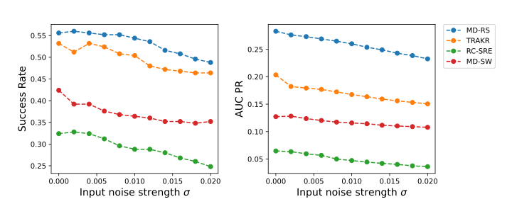

# MD-RS (Under Review)

## Architecture

## Overview

# Get Started

1. Install Python ..., PyTorch >= ....
2. Download data. You can obtain all benchmarks from [Google Cloud](). All the datasets are well pre-processed.
3. Train and evaluate. We provide the experiment scripts of all benchmarks under the folder  `./scripts`. You can reproduce the experiment results as follows:

# Main Results

## Note: Illusion of Performance in Point Adjustment (PA)
In [the code for DCdetector](https://github.com/DAMO-DI-ML/KDD2023-DCdetector/tree/main), the original anomaly scores are first converted into binary prediction labels using a thresholding operation.
After this, the true anomaly labels are referred to in order to perform Point Adjustment (PA) on the sequence (referred to as the PA sequence), which is then used as the new anomaly score.
Performance metrics such as Affiliation precision/recall, AUC, Range AUC, and VUS are calculated based on this PA sequence in [the code for DCdetector](https://github.com/DAMO-DI-ML/KDD2023-DCdetector/tree/main).

However, as shown in the example below, the PA sequence almost becomes identical to the true anomaly label sequence, resulting in performance metrics that are overly optimistic.

| Method                      | AUC ROC     | PR AUC      | Max F1 Score |
|-----------------------------|-------------|-------------|--------------|
| DCdetector (Anomaly Score)  | 0.499013335 | 0.037474823 | 0.025104603  |
| DCdetector (PA sequence)    | 0.998706897 | 0.965116279 | 0.963855422  |

## Overall Results

All of these results were calculated **without point adjustment (PA)**.
PA tends to make results appear more optimistic than they should, as shown above.

### UCR

### SMD

### SMAP

### MSL

### PSM

### SWaT

## Case Studies

## Noise Robustness Evaluation

### Performance for different noise strength $\sigma$

### Performance change rate for different noise strength $\sigma$ (baseline: $\sigma=0$)

